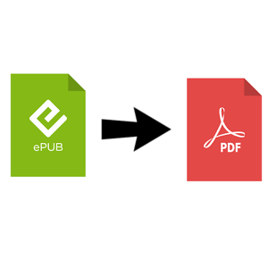

# EPUB-to-PDF

Telegram bot EPUB to PDF converter, this bot is available on Telegram with the following username: [@epub_to_pdf_bot](https://t.me/epub_to_pdf_bot)



### Usage

Just contact the Telegram bot [@epub_to_pdf_bot](https://t.me/epub_to_pdf_bot) and send a file.epub, you will receive back a file.pdf.

## Local installation (development)

### Requirements

- python3
- python-telegram-bot
- calibre (ebook-convert)

If you are using Linux as OS you could install the requirements using the package manager, for debian-based you could use the following command to install the main requirements:

```bash
sudo apt install python3 python3-pip calibre
```

To install the python-telegram-bot framework you can use `pip` the python package manager:

```bash
pip3 install python-telegram-bot
```

### Configure

Create a personal bot contacting [@Botfather](https://t.me/Botfather).
Created the bot you will receive an API token, so copy the file *token.conf.dist* into *token.conf*, delete the content and put inside the API token.

Well, now, you can run the script **main.py** and send to your bot the file.epub, you will get a file,pdf back.

## Docker installation (production)

```bash
docker build -t epub_to_pdf:latest .
docker run -d epub_to_pdf
```

### Credits

- [Helias](https://t.me/Helias)
- [v0lp3](https://t.me/v0lp3)
